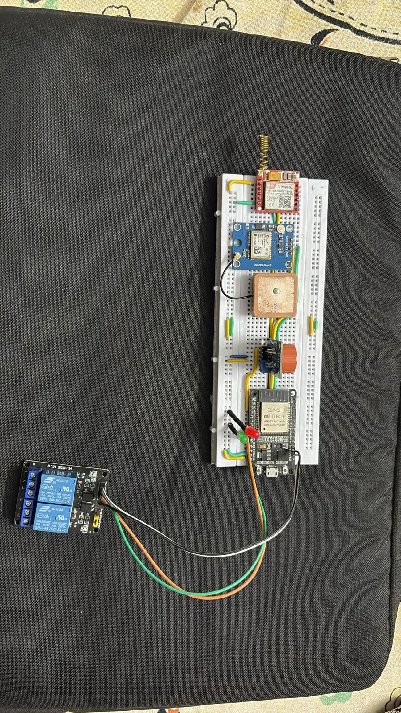

# Smart Helmet System


A comprehensive ESP32-based smart helmet system that detects alcohol consumption, tracks GPS location, and sends SMS alerts to emergency contacts.

## Features

- **Alcohol Detection** - MQ-3 sensor detects driver alcohol levels
- **GPS Tracking** - NEO-6M GPS module for real-time location tracking
- **SMS Alerts** - SIM800L GSM module sends emergency SMS with location
- **Vehicle Control** - 2-channel relay controls vehicle ignition and fuel pump
- **Audio Alert** - Buzzer provides audible warnings
- **LED Indicators** - Visual feedback for system status

## Hardware Components

| Component | Model | Purpose |
|-----------|-------|---------|
| Microcontroller | ESP32 | Main processing unit |
| Alcohol Sensor | MQ-3 | Breath alcohol detection |
| GPS Module | NEO-6M | Location tracking |
| GSM Module | SIM800L | SMS communication |
| Relay Module | 2-Channel | Vehicle ignition & fuel pump control |
| Buzzer | Active/Passive | Audio alert warnings |

## Hardware Image



## Complete Final Pin Reference

| Component | Function | GPIO |
|-----------|----------|------|
| MQ-3 AO | Alcohol level | GPIO34 |
| GPS | RX / TX | GPIO16 / 17 |
| GSM | TX / RX | GPIO12 / 13 |
| Green LED + 1kΩ | Safe indicator | GPIO25 |
| Red LED + 1kΩ | Alert indicator | GPIO26 |
| Relay 1 | Ignition cut | GPIO32 |
| Relay 2 | Fuel pump cut | GPIO33 |
| Buzzer | Audio alert | GPIO27 |

## Buzzer Behaviour

| Event | Buzzer Pattern |
|-------|---------------|
| System startup | 2 short beeps — "ready" |
| Alcohol detected (warning) | 3 long beeps — "warning, cutting power" |
| While alcohol present | Continuous fast beeping |
| Alcohol cleared | 2 short beeps — "safe" |

## Complete System Behaviour

| Situation | Green | Red | Relay 1 & 2 | Buzzer | SMS |
|-----------|-------|-----|-------------|--------|-----|
| Startup | ON | OFF | OFF | 2 beeps | — |
| Normal driving | ON | OFF | OFF | Silent | — |
| Alcohol detected | OFF | ON | ON | 3 warn + continuous | Sent |
| Alcohol cleared | ON | OFF | OFF | 2 beeps | — |

## Installation

1. Open `smart_helmet.ino` in Arduino IDE
2. Install required libraries:
   - TinyGPSPlus (by Mikal Hart)
3. Select ESP32 Dev Module as board
4. Upload to your ESP32

## Configuration

Edit these variables in the code:
```cpp
String phoneNumber = "+916381618970";  // Emergency contact
#define ALCOHOL_THRESHOLD 500;         // Sensitivity adjustment
```

## How It Works

1. **Startup**: System beeps twice and initializes all components
2. **Monitoring**: Continuously reads MQ-3 alcohol sensor
3. **Detection**: If alcohol detected above threshold:
   - Turns ON red LED
   - 3-second warning beeps
   - Disables vehicle (relays ON - cuts ignition & fuel)
   - Continuous alert beeping
   - Sends SMS with GPS location to emergency contact
4. **Reset**: When alcohol clears, re-enables vehicle and plays safe beeps

## SMS Messages

### Alcohol Alert
```
ALCOHOL ALERT!
Driver has consumed alcohol.
Vehicle has been stopped.

Last Location:
Lat: xx.xxxxxx
Lng: xx.xxxxxx
[Google Maps Link]
```

## License

MIT License
